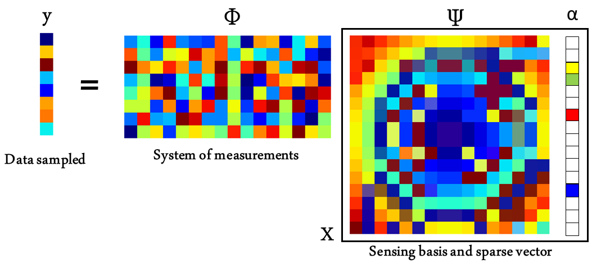

# CompressedSensingImaging
This repository includes software to recover interferometric images based on Compressed Sensing
# Introduction
## The "ill-posed" problem of interferometric imaging}
With a resolution power between ten and several thousand times better than stand-alone telescopes, interferometry is a technique capable of providing us the best angular resolution for astronomical observations. With the possibility to recover milliarcseconds (mas) images in the infrared and microarcseconds (&mu;as) with the new very long-baseline interferometers (VLBI) in the (sub-)millimeter, interferometry is key to research that goes from the search of exo-planets1 , to study high-mass stars2, proto-planetary disks3, to map the core of Active Galactic Nuclei4 and, to probe fundamental physics5.

Imaging is the most intuitive form to analyze complex interferometric data. At centimeter wavelengths, imaging has been possible since the 1960s. However, this is different in the infrared and with the new VLBI (sub-)millimeter arrays. There are two main problems: (i) the interferometric arrays are only composed by a few telescopes or antennas and; (ii) the atmosphere corrupts the phase of the observations, preventing their proper calibration, and forcing us to look for another observable to infer the centro-symmetric morphology of the observed source: the closure phase (see e.g., 6). During the last 20 years, the community has made a large effort to finance and to operate interferometric instruments in the infrared and millimeter, for example: GRAVITY (near-infrared), MATISSE (mid-infrared) at the Very Large Telescope Interferometer (VLTI), and the Event Horizon Telescope (millimeter). However, reconstructing images with these devices is still an area of development.

**Graphical decription of Compressed Sensing**  Figure 1. Visual representation of the matrices involved in Compressed Sensing. **&Psi;** has a dimension of **M** x **N** and, it represents the components of the sensing basis. The matrix **&Phi;** has a size of **S** x **M**. For example, a matrix with zeros and ones that masks the u-v frequencies that are not sampled by the interferometer. **&alpha;** is a vector that has only K non-zero coefficients that follows the condition:  K < S << N.

Interferometers in Astronomy provides us a level of detail proportional to the separation between each pair of telescopes, called baselines, that forms the array. Each one of these baselines maps information, at a given orientation, of the source’s brightness distribution. The interferometric observables are a series of amplitudes and phases of the different spatial frequencies that forms the powerspectrum of the source. Each one of the frequencies corresponds to different details in the image. The highest ones trace the finest textures (e.g., point-like objects), while the lowest ones trace the most extended textures (e.g., contours). An image is, thus, the composition of an infinite number of textures. However, the interferometer only samples a few of them.
From signal processing theory, recovering the image of an object from interferometric data is an “ill- posed” problem. Recovering all the pixels in the image with the limited information from an interferometer is a problem with an infinite number of solutions. Therefore, it is always necessary to include “a-priori” information about the source to solve the problem of the reconstruction.
These “prior” conditions could be implemented in different ways for the reconstruction. Identifying the most optimal form is, however, a complex problem. At centimeter wavelengths, where the phase and the amplitude of the visibilities are known, Fourier inversion techniques (or deconvolution) are used, being CLEAN7  the most used one. With the sparse arrays, the situation is different. Here, most of the time the observables do not have a proper calibration of the Fourier phases. Therefore, regularized least-squares minimization algorithms are used for the reconstruction. The optimization is done by lowering the residuals between a model image and the data (the likelihood) and a series of regularization functions (the priors) where the inferences about the source morphology are included.

## Limitations of the current reconstruction methods
Despite advances in the field over the last two decades, the current imaging scheme is far from optimal. These are some of the most important problems faced by the current image-reconstruction algorithms for sparse arrays:

a) The selection of regularizers is arbitrary and their effectiveness depends strongly on the “a-priori”
knowledge of the source’s brightness distribution, u-v coverage, and pixel grid input parameters. This is a particularly serious problem (i) when sources are mapped for the first time, (ii) when unknown structures are tried to be discovered, and/or (iii) when there is temporal or spectral variability.

b) Selecting the weights between the different priors is complex and correlations between them might lead to strong artifacts, creating non-linear responses with the likelihood, which makes it hard to evaluate the optimal trade-off between the different terms in the minimization.

c) Image reconstruction is an “ad-hoc” technique for individual objects, and not fully suitable for
survey-like interferometric campaigns.
Even with good data sets that are processed by experts, different convergence schemes and priors lead to results with artifacts (see e.g., the results presented in 8). Neglecting the improvement of the image reconstruction framework for sparse arrays seriously limits their potential and keeps the community very small. It is also a serious detriment in the optimization of the invested resources.

## Compressed Sensing
Compressed Sensing (CS) allows us to recover a signal with less samples that the ones established from the Nyquist/Shannon theorem (see e.g. 9-11). For the technique to work, the signal must be sparse and compressible on a given basis. It means that the signal can be represented by a linear combination of functions with a small number of non-zero coefficients. In CS, a set of measurements, **y**, of a given signal, **x**, can be encoded by a multiplication of the matrices **&Phi;**, **&Psi;**, and the sparse vector **&alpha;**. **&Psi;** is the transformation basis where the full signal, **x**, is sparse, and only a few coefficients in the vector **&alpha;** are non-zero. **&Phi;** is, thus, the system of measurements under which the data are taken. For a visual representation of the matrices involved in CS see Fig. 1. It is important to remark that the number of measurements in **y** is considerably smaller than the number of features/columns in  in **&Psi;**, therefore, the inverse problem to find **&alpha;** is "ill-posed". CS establishes that if the product &Theta; = **&Phi;** **&Psi;** satisfies the Restricted Isometry Property (RIP)10, 12, we will be able to recover the signal from the sub-sampled measurements. Therefore, compressed Sensing offers us a framework to solve the "ill-posed" inverse problem by a regularized optimization, using as prior the sparsity of &alpha; and/or the degree of compressibility of the signal. 

Interferometric data are ideal to use Compressed Sensing for two reasons: (i) the data are a series of semi- independent measurements which provide the incoherent sampling that is needed; (ii) the interferometric data are measurements of structured images, it means that the images are highly compressible.
The role of CS for inteferometric imaging has gain importance in the recent years. Particularly, there has been new developments in Radio Astronomy. For example PURIFY13, shows how reconstruction algorithms based on Compressed Sensing outperforms CLEAN and its variants such as MS-CLEAN and ASP-CLEAN. It is interesting to mention that this work discusses the increment in processing speed gained with Compressed Sensing over other methods. More recently, 14 uses CS for imaging real Very Large Array (VLA) data; and  15 highlights the use of CS for dimensionality reduction applied to radio inferferometric data. Additional works on CS applied to astronomical imaging include 16, 17 and 18.

# References 
[1]  GRAVITY Collaboration, Lacour, S., Nowak, M., Wang, J., Pfuhl, O., Eisenhauer, F., et al., “First directdetection  of  an  exoplanet  by  optical  interferometry-astrometry  and  k-band  spectroscopy  of  hr  8799  e,”Astronomy & Astrophysics623, L11 (2019).

[2]  GRAVITY Collaboration, Sanchez-Bermudez, J., Weigelt, G., Bestenlehner, J. M., Kervella, P., Brandner,W.,  Henning,  T.,  M ̈uller,  A.,  Perrin,  G.,  Pott,  J.-U.,  Sch ̈oller,  M.,  van Boekel,  R.,  et al.,  “Gravity chro-matic imaging ofηcar’s core-milliarcsecond resolution imaging of the wind-wind collision zone (brγ, he i),”Astronomy & Astrophysics618, A125 (2018).

[3]  GRAVITY Collaboration, Garcia Lopez, R., Natta, A., et al., “A measure of the size of the magnetosphericaccretion region in tw hydrae,”Nature584, 547 (2020).

[4]  GRAVITY Collaboration, Amorim, A., Baub ̈ock, M., Brandner, W., Cl ́enet, Y., Davies, R., de Zeeuw, P.,et al., “The spatially resolved broad line region of iras 09149- 6206,”Astronomy & Astrophysics643, A154(2020).

[5]  Gravity Collaboration, Abuter, R., Amorim, A., Anugu, N., Baub ̈ock, M., Benisty, M., Berger, J., et al.,“Detection of the gravitational redshift in the orbit of the star s2 near the galactic centre massive blackhole,”Astronomy & Astrophysics615, L15 (2018).

[6]  Monnier, J. D., “Optical interferometry in astronomy,”Reports on Progress in Physics66(5), 789 (2003).

[7]  H ̈ogbom, J., “Aperture synthesis with a non-regular distribution of interferometer baselines,”Astronomyand Astrophysics Supplement Series15, 417 (1974).

[8]  Sanchez-Bermudez, J., Thi ́ebaut, E., Hofmann, K. H., Heininger, M., Schertl, D., Weigelt, G., Millour, F.,Schutz, A., Ferrari, A., Vannier, M., Mary, D., and Young, J., “The 2016 interferometric imaging beautycontest,” in [Optical and Infrared Interferometry and Imaging V], Malbet, F., Creech-Eakman, M. J., andTuthill, P. G.,  eds.,Society  of  Photo-Optical  Instrumentation  Engineers  (SPIE)  Conference  Series9907,99071D (Aug. 2016).

[9]  Donoho, D. L., “Compressed sensing,”IEEE Transactions on information theory52(4), 1289–1306 (2006).

[10]  Candes, E. J., Romberg, J. K., and Tao, T., “Stable signal recovery from incomplete and inaccurate mea-surements,”Communications on Pure and Applied Mathematics:  A Journal Issued by the Courant Instituteof Mathematical Sciences59(8), 1207–1223 (2006).

[11]  Baraniuk,  R.,  Davenport,  M.,  DeVore,  R.,  and  Wakin,  M.,  “A  simple  proof  of  the  restricted  isometryproperty for random matrices,”Constructive Approximation28(3), 253–263 (2008).

[12]  Candes, E. J. and Tao, T., “Decoding by linear programming,”IEEE  Transactions  on  Information  The-ory51(12), 4203–4215 (2005).

[13]  Carrillo, R. E., McEwen, J. D., and Wiaux, Y., “PURIFY: a new approach to radio-interferometric imaging,”Monthly Notices of the Royal Astronomical Society439, 3591–3604 (02 2014).

[14]  Pratley, L., McEwen, J. D., d’Avezac, M., Carrillo, R. E., Onose, A., and Wiaux, Y., “Robust sparse imagereconstruction of radio interferometric observations with purify,”Monthly Notices of the Royal AstronomicalSociety473, 1038–1058 (09 2017).

[15]  Vijay Kartik, S., Carrillo, R. E., Thiran, J.-P., and Wiaux, Y., “A Fourier dimensionality reduction modelfor big data interferometric imaging,”Monthly  Notices  of  the  Royal  Astronomical  Society468, 2382–2400(03 2017).

[16]  Wiaux,  Y.,  Jacques,  L.,  Puy,  G.,  Scaife,  A.  M.,  and  Vandergheynst,  P.,  “Compressed  sensing  imagingtechniques for radio interferometry,”Monthly Notices of the Royal Astronomical Society395(3), 1733–1742(2009).

[17]  Wenger,  S.,  Magnor,  M.,  Pihlstr ̈om,  Y.,  Bhatnagar,  S.,  and  Rau,  U.,  “Sparseri:  A  compressed  sensingframework for aperture synthesis imaging in radio astronomy,”Publications of the Astronomical Society ofthe Pacific122(897), 1367 (2010).

[18]  Li, S., Mi, T., and Liu, Y., “Sparse dual frames in compressed sensing,” in [Wavelets  and  Sparsity  XIV],Papadakis, M., Ville, D. V. D., and Goyal, V. K., eds.,8138, 180 – 191, International Society for Opticsand Photonics, SPIE (2011)
