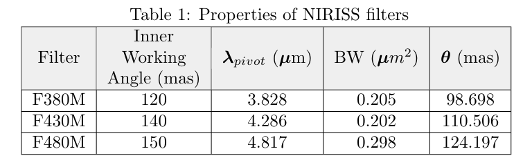
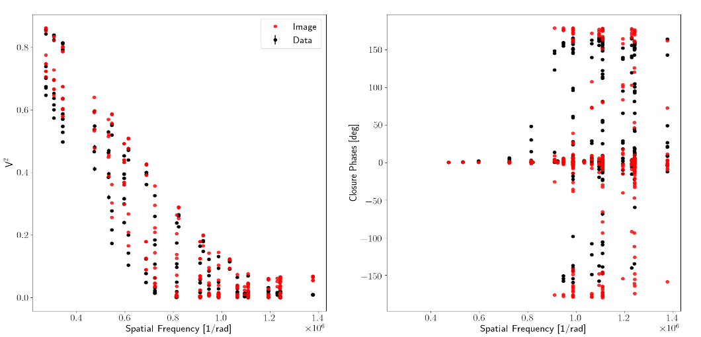

# CompressedSensingImaging
This repository includes software to recover interferometric images based on Compressed Sensing
# 1. Introduction
## 1.1 The "ill-posed" problem of interferometric imaging
With a resolution power between ten and several thousand times better than stand-alone telescopes, interferometry is a technique capable of providing us the best angular resolution for astronomical observations. With the possibility to recover milliarcseconds (mas) images in the infrared and microarcseconds (&mu;as) with the new very long-baseline interferometers (VLBI) in the (sub-)millimeter, interferometry is key to research that goes from the search of exo-planets1 , to study high-mass stars2, proto-planetary disks3, to map the core of Active Galactic Nuclei4 and, to probe fundamental physics5.

Imaging is the most intuitive form to analyze complex interferometric data. At centimeter wavelengths, imaging has been possible since the 1960s. However, this is different in the infrared and with the new VLBI (sub-)millimeter arrays. There are two main problems: (i) the interferometric arrays are only composed by a few telescopes or antennas and; (ii) the atmosphere corrupts the phase of the observations, preventing their proper calibration, and forcing us to look for another observable to infer the centro-symmetric morphology of the observed source: the closure phase (see e.g., 6). During the last 20 years, the community has made a large effort to finance and to operate interferometric instruments in the infrared and millimeter, for example: GRAVITY (near-infrared), MATISSE (mid-infrared) at the Very Large Telescope Interferometer (VLTI), and the Event Horizon Telescope (millimeter). However, reconstructing images with these devices is still an area of development.

**Graphical decription of Compressed Sensing** 

  

Figure 1. Visual representation of the matrices involved in Compressed Sensing. **&Psi;** has a dimension of **M** x **N** and, it represents the components of the sensing basis. The matrix **&Phi;** has a size of **S** x **M**. For example, a matrix with zeros and ones that masks the u-v frequencies that are not sampled by the interferometer. **&alpha;** is a vector that has only K non-zero coefficients that follows the condition:  K < S << N.

Interferometers in Astronomy provides us a level of detail proportional to the separation between each pair of telescopes, called baselines, that forms the array. Each one of these baselines maps information, at a given orientation, of the source’s brightness distribution. The interferometric observables are a series of amplitudes and phases of the different spatial frequencies that forms the powerspectrum of the source. Each one of the frequencies corresponds to different details in the image. The highest ones trace the finest textures (e.g., point-like objects), while the lowest ones trace the most extended textures (e.g., contours). An image is, thus, the composition of an infinite number of textures. However, the interferometer only samples a few of them.
From signal processing theory, recovering the image of an object from interferometric data is an “ill- posed” problem. Recovering all the pixels in the image with the limited information from an interferometer is a problem with an infinite number of solutions. Therefore, it is always necessary to include “a-priori” information about the source to solve the problem of the reconstruction.
These “prior” conditions could be implemented in different ways for the reconstruction. Identifying the most optimal form is, however, a complex problem. At centimeter wavelengths, where the phase and the amplitude of the visibilities are known, Fourier inversion techniques (or deconvolution) are used, being CLEAN7  the most used one. With the sparse arrays, the situation is different. Here, most of the time the observables do not have a proper calibration of the Fourier phases. Therefore, regularized least-squares minimization algorithms are used for the reconstruction. The optimization is done by lowering the residuals between a model image and the data (the likelihood) and a series of regularization functions (the priors) where the inferences about the source morphology are included.

## 1.2 Limitations of the current reconstruction methods
Despite advances in the field over the last two decades, the current imaging scheme is far from optimal. These are some of the most important problems faced by the current image-reconstruction algorithms for sparse arrays:

a) The selection of regularizers is arbitrary and their effectiveness depends strongly on the “a-priori”
knowledge of the source’s brightness distribution, u-v coverage, and pixel grid input parameters. This is a particularly serious problem (i) when sources are mapped for the first time, (ii) when unknown structures are tried to be discovered, and/or (iii) when there is temporal or spectral variability.

b) Selecting the weights between the different priors is complex and correlations between them might lead to strong artifacts, creating non-linear responses with the likelihood, which makes it hard to evaluate the optimal trade-off between the different terms in the minimization.

c) Image reconstruction is an “ad-hoc” technique for individual objects, and not fully suitable for
survey-like interferometric campaigns.
Even with good data sets that are processed by experts, different convergence schemes and priors lead to results with artifacts (see e.g., the results presented in 8). Neglecting the improvement of the image reconstruction framework for sparse arrays seriously limits their potential and keeps the community very small. It is also a serious detriment in the optimization of the invested resources.

## 1.3 Compressed Sensing
Compressed Sensing (CS) allows us to recover a signal with less samples that the ones established from the Nyquist/Shannon theorem (see e.g. 9-11). For the technique to work, the signal must be sparse and compressible on a given basis. It means that the signal can be represented by a linear combination of functions with a small number of non-zero coefficients. In CS, a set of measurements, **y**, of a given signal, **x**, can be encoded by a multiplication of the matrices **&Phi;**, **&Psi;**, and the sparse vector **&alpha;**. **&Psi;** is the transformation basis where the full signal, **x**, is sparse, and only a few coefficients in the vector **&alpha;** are non-zero. **&Phi;** is, thus, the system of measurements under which the data are taken. For a visual representation of the matrices involved in CS see Fig. 1. It is important to remark that the number of measurements in **y** is considerably smaller than the number of features/columns in  in **&Psi;**, therefore, the inverse problem to find **&alpha;** is "ill-posed". CS establishes that if the product &Theta; = **&Phi;** **&Psi;** satisfies the Restricted Isometry Property (RIP)10, 12, we will be able to recover the signal from the sub-sampled measurements. Therefore, compressed Sensing offers us a framework to solve the "ill-posed" inverse problem by a regularized optimization, using as prior the sparsity of &alpha; and/or the degree of compressibility of the signal. 

Interferometric data are ideal to use Compressed Sensing for two reasons: (i) the data are a series of semi- independent measurements which provide the incoherent sampling that is needed; (ii) the interferometric data are measurements of structured images, it means that the images are highly compressible.
The role of CS for inteferometric imaging has gain importance in the recent years. Particularly, there has been new developments in Radio Astronomy. For example PURIFY13, shows how reconstruction algorithms based on Compressed Sensing outperforms CLEAN and its variants such as MS-CLEAN and ASP-CLEAN. It is interesting to mention that this work discusses the increment in processing speed gained with Compressed Sensing over other methods. More recently, 14 uses CS for imaging real Very Large Array (VLA) data; and  15 highlights the use of CS for dimensionality reduction applied to radio inferferometric data. Additional works on CS applied to astronomical imaging include 16, 17 and 18.

In this work, we use CS to recover infrared interferometric images from simulated Aperture Masking data.The  algorithm  presented is our proof of concept to  explore this novel technique to recover reliable infrared interferometric images. The manuscript is divided as follows: Sec. 2 describes our interferometric simulations;Sec. 3 presents our algorithm and results and; Sec. 4 summarizes our work and presents a scope for future developments.

# 2. JAMES-WEBB SPACE TELESCOPE SIMULATIONS

We simulated observations obtained with the Sparse Aperture Masking (SAM) mode of the instrument NIRISS(Near Infrared Imager and Slitless Spectrograph)19,20 deployed at the James-Webb Space Telescope (JWST). NIRISS is an infrared (band-pass = 0.8 - 5μm) high-resolution camera which allows us to observe an object using Fizeau interferometry in the form of SAM. SAM is a technique which allows us to transform a telescope into an interferometer by placing a non-redundant mask with several pin-holes in the pupil plane of the telescope21. Therefore, at the image plane an interferogram is  formed  (see  Fig.   2). From  the  interferograms,  interferometric  observables  (Fourier  visibilities  and  phases, squared  visibilities  and  closure  phases)  are  extracted.   The  non-redundant  mask  on-board  of  NIRISS  has 7 pinholes, which produces 21 visibilities and 35 closure phases per snapshot.  For the simulations reported, wefitted the fringes directly in the image plane using a model of the mask geometry and filter bandwidth. From this model the observables were computed using a single-value decomposition (SVD) algorithm. This method is similar to the one presented by 22.  To evaluate the validity of our algorithm, we compared the observables extracted with the ones obtained with ImPlaneIA23, finding similar results.

**u-v plane and simulated data**  Figure 2: **Left:** u-v coverage of our observations.  The panel displays the spatial frequencies sampled with our interferometric data for three different filters (see label on the image). From this u-v plane, 189 visibilities and 315  closure  phases  are  obtained. **Right:** Simulated interferogram at 3.8μm. The  morphology of the targetis convolved with the instrumental transfer function. Notice that the contrast of the fringe pattern decreased, blurring the interferogram due to the extended emission of the target.

The SAM data, consisted in the simulation of an inclined and asymmetric proto-planetary disk observed atthree different filters (see Table 1) with the following central wavelengths:  3.8μm, 4.3μm and 4.8μm.  Given the pointing limitations of the JWST, we considered a maximum of three pointing positions at a position angle(E->N) of -10◦, 0◦ and 10◦. To make the JWST/SAM simulations as realistic as possible, we included piston errors between 10 and 50 nm.  These are typical expected error values of the instrumental transfer function.  The simulated science data were calibrated with simulated interferograms of point-like objects with similar pistonerrors as the science data.  The u-v coverage employed for image reconstruction includes 318 data points (V2 + Fourier phases + CPs) and combines the different simulated pointing positions and wavelengths (see Fig. 2). Finally, the simulated data was stored into a standard OIFITS24 file.

  

# 3. OPTIMIZATION BASED ON COMPRESSED SENSING

To solve the image optimization problem, the python scikit-learn25 library was used. More explicitly, the Least Absolute Shrinkage and Selection Operator (LASSO) algorithm26 was selected. This LASSO implementation uses a regularized minimization of the following form:

where N is the total number of elements in the sampled signal, y, and λ is the value of the hyperparameter that weights the regularizer. It is important to remark that the constraint region of the l1-norm has the form of an hypercube with several corners, which ensure sparsity of &alpha; for a convex optimization problem.  This is not the case by using, for example a Ridge regression27 with ‖&alpha;‖22, where the constraint region is a rotationalinvariant n-sphere.  This can also be interpreted as LASSO being a linear regression model with a Laplace prior distribution, with a sharp peak at its mean. In contrast, Gaussian prior distribution of coefficients in a Ridge regression28 has a more soften peak around its mean.

**Diagram of the Compressed Sensing Algorithm**

  

Figure 4: The diagram shows a visual representation of the CS LASSO implementation of our work. A Dictionary of models (**&theta;** = **&Phi;&Psi;**) is created with a group of images (**&Psi;**), which are transformed into the measured observables atthe simulated u-v plane (**&Phi;**).  Then, the Dictionary is compared with the data (**y**) and a set of non-zero coefficients (**&alpha;**) are selected. This process is repeated over a given number of iterations until the best-fit reconstructed image (**x**) is obtained.

Before performing the minimization, a precomputed Dictionary (Θ) with 104 different disk-like structures was created. The random images of the disks were created  using a pixel grid of 71×71 pixels with a pixelscale of 10 milliarcseconds (mas). To transform those images into the system of measurements of our data, their Fourier transform were performed using a proprietary implementation of the regularly spaced Fast Fourier Transform (FFT) and, the observables (squared visibilities, Fourier phases and closure phases) were obtained for the sampled u-v frequencies. Each set of observables was centered and scaled to have a mean equals to zero and standard deviation equals to the unity. Finally, the different observables were merged into a single column vector (or atom). The different atoms were stacked to create the different columns of the final Dictionary and stored into a python binary file. Once the Dictionary was integrated, LASSO was used to solve for the non-zero coefficients of α that fit the observables and reconstruct the image.  LASSO worked over 103 iterations with a pre-defined value of the hyperparameter λ. Figure 4 displays a schematic representation of the described algorithm.
  
  Figure 5 shows the best-fit image obtained with our CS LASSO algorithm together with the original model image. Notice that the general structure of the disk is reproduced. The reconstructed morphology shows the correct inclination and position angle. It also shows the brighter emission of the ring along the semi-major axis. The inner cavity is also clearly observed. However, the size of the semi-minor axis is larger than the one of the model image. This can be appreciated in the map of the residuals formed by subtracting the image model from the reconstructed one. Figure 6 shows that the observables are well reproduced by the reconstructed image.
  
**Best-fit image based on Compressed Sensing**Figure 5: **Left:** Model image from which the simulated data were obtained. **Middle:** Reconstructed CS LASSO image. **Right:** Map of residuals. The **left** and **right** panels are normalized to the unity and the color map scale is the same for an easy comparison between the two of them.

**Recovered observables from reconstructed CS image**

  

Figure 6:  Comparison between the data (black dots) and the recovered Squared visibilities and Closure Phases from the reconstructed CS LASSO images. The **left** panel displays the squared visibilities versus spatial frequency while the **right** panel shows the closure phases versus spatial frequencies.

We tested various values of λ to systematically determine how it is affecting the reconstruction. In Figure 7, there are plotted the reconstructions obtained with four values of λ: 0.001, 0.01, 0.1 and 0.5. The recovered structures of the maps change for different values of the hyperparameter, being λ = 0.01 the optimal one. When the image is over-regularized by enforcing a minimum number of components, the structure of the target appears to be completely different to the real structure. In our case, the solution with λ = 0.5 is only formed by one single atom from the Dictionary. On the other hand, when the image is under-regularized, additional structures appear on the recovered map. For example, the image obtained with λ= 0.001 shows a central component at the position of the inner cavity.  For this reconstruction, 419 non-zero atoms served to recover the image. Not having a reliable method to select the value of λ is an important limitation not only for this implementation of CS LASSO but for other methods available in the community. In this work the best value of λ was manually selected after trying several values and visually inspecting the solutions. However, this procedure is far from optimal. One possibility to ameliorate the problem is to use decision tree algorithms (see e.g. 29) to discriminate between the different hyperparameter values.  This methodology will be tested and implemented in future developments of our software.

**Role of λ on Compressed Sensing images**

  

Figure 7:  The panels display the reconstructed CS LASSO images using different values of the hyperparameter, λ(see label on the text). Notice that the structure changes significantly between the over-regularized and the under-regularized images.

To  evaluate the quality of our reconstructions, we also generated images using two other codes available in  the  community: BSMEM30 and SQUEEZE31. The first one uses maximum entropy for the regularization and a gradient descent method with a trust region for the minimization. The second one could use different types of regularizations, including sparsity (in the form of the l0-norm). For the minimization a Markov-Chain Monte-Carlo (MCMC) algorithm  is  employed.  Similar pixel scale and grid parameters between CS and the reconstructions using BSMEM and SQUEEZE were used. Figure 8 shows the  reconstructions obtained with each one of the different software. Notice that the three algorithms managed to recover the general (position angle and size) structure of the target. However, different artifacts are observed. For example, the BSMEM image shows the two brightest spots of the disk. However, it does not recover the central cavity. This can be easily explained because the Maximum Entropy enforces a smooth brightness transition between the different pixels in the image. The SQUEEZE reconstruction using the l0-norm shows a map with a ”granular” structure, which does not provide well defined loci for the maximum. This image does not show a clear cavity. We remark that the SQUEEZE image can be improved by using additional regularizers. Nevertheless, this is obtained at the cost of being slower. Also, the selection of the hyperaparameters becomes more complicated for more regularizers involved in the reconstruction. Both the SQUEEZE and BSMEM images show additional artifacts around the central source. This is not the case of the CS LASSO image, which shows a uniform background. To estimate the signal-to-noise ratio (SNR) between the peak of the emission and the noise floor of the images, we computed the mean value of the background using all the pixels outside a circular mask with a radius of 15 pixels centered at the middle of the image. The SNR values are: 3.7 x 104, 1.0 x 102 and 0.8 x 102 for the CS LASSO, SQUEEZE and BSMEM images, respectively.  These values suggest that the CS LASSO reconstruction achieved a contrast two orders of magnitude larger than the other reconstructions.  This is particularly encouraging for the case of high-contrast observations as the ones expected with the JWST. A more detailed analysis of the contrast ratios achieved with CS will be done in a future work.

**Comparison between Compressed Sensing and other software**  Figure 8: **Left:** Reconstructed CS LASSO image. **Middle:** Reconstructed SQUEEZE image. **Right:** Reconstructed BSMEM image. 

## SUMMARY AND FUTURE WORK
In this work, we present infrared interferometric image reconstruction using Compressed Sensing. This new framework has demonstrated to be an important tool to solve the ill-posed problem of interferometric imaging. Our proof of concept algorithm and the preliminary tests show that the technique has the potential to recover reliable images with the minimum number of components of the sensing basis (or Dictionary). This is translated into a high-contrast images which appears  to surpass the level of precision of other methods available in the community. For CS reconstructions, we noticed a decrease in the number of the residuals caused by the incompleteness of the u-v coverage and by the effect of the regularizer, compared with other methods. However, to fully test the validity of these results, we consider that this new technique should be explored in more detail, not only on simulated data but on real ones; for example, by using observations obtained with interferometers like GRAVITY/VLTI or MATISSE/VLTI. Future developments of our CS algorithm include the development of a systematic methodology to select the  hyperparameter value, the implementation of chromatic reconstructions and the recovery of images with temporal variability. In particular, CS provides us the framework to test techniques such as Dynamic Mode Decomposition (DMD). It is new data-driven method that uses time-resolved data sets to provide a temporal decomposition of the data in different structures (called “modes”) that are spatially coherent, and from which a subsequent reconstruction of the original signal could be performed.

## ACKNOWLEDGMENTS

JSB, ARG, and HM acknowledges the full support from the UNAM PAPIIT project IA 101220. ARG acknowledges the PhD scholarship granted by CONACyT (CVU:  858378).   JSB  and  AS  thank  the  STScI  Director’s Discretionary Fund for travel support. AA and RS acknowledge financial support from the State Agency for Research of  the Spanish MCIU through the ”Center of Excellence Severo Ochoa” award for the Instituto de Astrofísica de Andalucía (SEV-2017-0709)

# References 
[1]  GRAVITY Collaboration, Lacour, S., Nowak, M., Wang, J., Pfuhl, O., Eisenhauer, F., et al., “First directdetection  of  an  exoplanet  by  optical  interferometry-astrometry  and  k-band  spectroscopy  of  hr  8799  e,”Astronomy & Astrophysics623, L11 (2019).

[2]  GRAVITY Collaboration, Sanchez-Bermudez, J., Weigelt, G., Bestenlehner, J. M., Kervella, P., Brandner,W.,  Henning,  T.,  M ̈uller,  A.,  Perrin,  G.,  Pott,  J.-U.,  Sch ̈oller,  M.,  van Boekel,  R.,  et al.,  “Gravity chro-matic imaging ofηcar’s core-milliarcsecond resolution imaging of the wind-wind collision zone (brγ, he i),”Astronomy & Astrophysics618, A125 (2018).

[3]  GRAVITY Collaboration, Garcia Lopez, R., Natta, A., et al., “A measure of the size of the magnetosphericaccretion region in tw hydrae,”Nature584, 547 (2020).

[4]  GRAVITY Collaboration, Amorim, A., Baub ̈ock, M., Brandner, W., Cl ́enet, Y., Davies, R., de Zeeuw, P.,et al., “The spatially resolved broad line region of iras 09149- 6206,”Astronomy & Astrophysics643, A154(2020).

[5]  Gravity Collaboration, Abuter, R., Amorim, A., Anugu, N., Baub ̈ock, M., Benisty, M., Berger, J., et al.,“Detection of the gravitational redshift in the orbit of the star s2 near the galactic centre massive blackhole,”Astronomy & Astrophysics615, L15 (2018).

[6]  Monnier, J. D., “Optical interferometry in astronomy,”Reports on Progress in Physics66(5), 789 (2003).

[7]  H ̈ogbom, J., “Aperture synthesis with a non-regular distribution of interferometer baselines,”Astronomyand Astrophysics Supplement Series15, 417 (1974).

[8]  Sanchez-Bermudez, J., Thi ́ebaut, E., Hofmann, K. H., Heininger, M., Schertl, D., Weigelt, G., Millour, F.,Schutz, A., Ferrari, A., Vannier, M., Mary, D., and Young, J., “The 2016 interferometric imaging beautycontest,” in [Optical and Infrared Interferometry and Imaging V], Malbet, F., Creech-Eakman, M. J., andTuthill, P. G.,  eds.,Society  of  Photo-Optical  Instrumentation  Engineers  (SPIE)  Conference  Series9907,99071D (Aug. 2016).

[9]  Donoho, D. L., “Compressed sensing,”IEEE Transactions on information theory52(4), 1289–1306 (2006).

[10]  Candes, E. J., Romberg, J. K., and Tao, T., “Stable signal recovery from incomplete and inaccurate mea-surements,”Communications on Pure and Applied Mathematics:  A Journal Issued by the Courant Instituteof Mathematical Sciences59(8), 1207–1223 (2006).

[11]  Baraniuk,  R.,  Davenport,  M.,  DeVore,  R.,  and  Wakin,  M.,  “A  simple  proof  of  the  restricted  isometryproperty for random matrices,”Constructive Approximation28(3), 253–263 (2008).

[12]  Candes, E. J. and Tao, T., “Decoding by linear programming,”IEEE  Transactions  on  Information  The-ory51(12), 4203–4215 (2005).

[13]  Carrillo, R. E., McEwen, J. D., and Wiaux, Y., “PURIFY: a new approach to radio-interferometric imaging,”Monthly Notices of the Royal Astronomical Society439, 3591–3604 (02 2014).

[14]  Pratley, L., McEwen, J. D., d’Avezac, M., Carrillo, R. E., Onose, A., and Wiaux, Y., “Robust sparse imagereconstruction of radio interferometric observations with purify,”Monthly Notices of the Royal AstronomicalSociety473, 1038–1058 (09 2017).

[15]  Vijay Kartik, S., Carrillo, R. E., Thiran, J.-P., and Wiaux, Y., “A Fourier dimensionality reduction modelfor big data interferometric imaging,”Monthly  Notices  of  the  Royal  Astronomical  Society468, 2382–2400(03 2017).

[16]  Wiaux,  Y.,  Jacques,  L.,  Puy,  G.,  Scaife,  A.  M.,  and  Vandergheynst,  P.,  “Compressed  sensing  imagingtechniques for radio interferometry,”Monthly Notices of the Royal Astronomical Society395(3), 1733–1742(2009).

[17]  Wenger,  S.,  Magnor,  M.,  Pihlstr ̈om,  Y.,  Bhatnagar,  S.,  and  Rau,  U.,  “Sparseri:  A  compressed  sensingframework for aperture synthesis imaging in radio astronomy,”Publications of the Astronomical Society ofthe Pacific122(897), 1367 (2010).

[18]  Li, S., Mi, T., and Liu, Y., “Sparse dual frames in compressed sensing,” in [Wavelets  and  Sparsity  XIV],Papadakis, M., Ville, D. V. D., and Goyal, V. K., eds.,8138, 180 – 191, International Society for Opticsand Photonics, SPIE (2011)

[19]  Doyon,  R.,  Hutchings,  J.  B.,  Beaulieu,  M.,  Albert,  L.,  Lafreniere,  D.,  Willott,  C.,  et  al.,  “The  JWSTFine  Guidance  Sensor  (FGS)  and  Near-Infrared  Imager  and  Slitless  Spectrograph  (NIRISS),”  in  [SpaceTelescopes  and  Instrumentation  2012:   Optical,  Infrared,  and  Millimeter  Wave],  Clampin,  M.  C.,  Fazio,G.  G.,  MacEwen,  H.  A.,  and  Oschmann,  Jacobus  M.,  J.,  eds.,Society  of  Photo-Optical  InstrumentationEngineers (SPIE) Conference Series8442, 84422R (Sept. 2012).

[20]  Sivaramakrishnan, A., Tuthill, P. G., Ireland, M. J., Lloyd, J. P., Martinache, F., Soummer, R., Makidon,R. B., Doyon, R., Beaulieu, M., and Beichman, C. A., “Planetary system and star formation science withnon-redundant masking on JWST,” in [Techniques  and  Instrumentation  for  Detection  of  Exoplanets  IV],Shaklan,  S. B.,  ed.,Society  of  Photo-Optical  Instrumentation  Engineers  (SPIE)  Conference  Series7440,74400Y (Aug. 2009).

[21]  Sanchez-Bermudez, J., Sch ̈odel, R., Alberdi, A., and Pott, J. U., “NaCo/SAM observations of sources atthe Galactic Center,” in [Journal of Physics Conference Series],Journal of Physics Conference Series372,012025 (July 2012).

[22]  Lacour, S., Tuthill, P., Amico, P., Ireland, M., Ehrenreich, D., Huelamo, N., and Lagrange, A.-M., “Sparseaperture masking at the vlt-i. faint companion detection limits for the two debris disk stars hd 92945 andhd 141569,”Astronomy & Astrophysics532, A72 (2011).

[23]  Greenbaum, A. Z., Pueyo, L., Sivaramakrishnan, A., and Lacour, S., “An Image-plane Algorithm for JWST’sNon-redundant Aperture Mask Data,”798, 68 (Jan. 2015).

[24]  Pauls, T. A., Young, J. S., Cotton, W. D., and Monnier, J. D., “A Data Exchange Standard for Optical(Visible/IR) Interferometry,”117, 1255–1262 (Nov. 2005).

[25]  Pedregosa, F., Varoquaux, G., Gramfort, A., Michel, V., Thirion, B., Grisel, O., Blondel, M., Prettenhofer,P.,  Weiss,  R.,  Dubourg,  V.,  Vanderplas,  J.,  Passos,  A.,  Cournapeau,  D.,  Brucher,  M.,  Perrot,  M.,  andDuchesnay,  E.,  “Scikit-learn:   Machine  learning  in  Python,”Journal  of  Machine  Learning  Research12,2825–2830 (2011).

[26]  Santosa, F. and Symes, W. W., “Linear inversion of band-limited reflection seismograms,”SIAM  Journalon Scientific and Statistical Computing7(4), 1307–1330 (1986).

[27]  Gruber,  M.,  [Improving  Efficiency  by  Shrinkage:   The  James–Stein  and  Ridge  Regression  Estimators],vol. 156, CRC Press (1998).

[28]  Tibshirani, R., “Regression shrinkage and selection via the lasso,”Journal of the Royal Statistical Society:Series B (Methodological)58(1), 267–288 (1996).

[29]  Rokach, L. and Maimon, O., [Data mining with decision trees. Theory and applications], vol. 69 (01 2008).

[30]  Buscher, D., “Very high angular resolution imaging (iau symp. 158), ed. jg robertson & wj tango,” (1994).[31]  Baron, F., Monnier, J. D., and Kloppenborg, B., “A novel image reconstruction software for optical/infraredinterferometry,” in [Optical and Infrared Interferometry II],7734, 77342I, International Society for Opticsand Photonics (2010).
